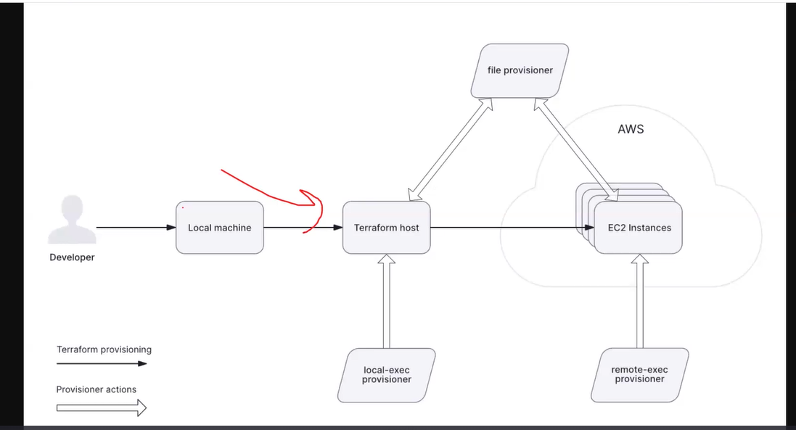

Terraform state Drift
    someone did a change in the console directly on top of terraform changes
    Modify that tf file to account that change
        **terraform import** that change 
        The details are given in the documentation
```
terraform import aws_security_group_rule.http_ingress_access sg-02e3fbdeb00649570_ingress_tcp_80_80_0.0.0.0/0

```

# State Providers
Many options
    * Databases
    * S3
    * other cloud providers etc

Its called backend

state file pull to see the output 
```
terraform state pull
```

# getting vars in output.tf
these will get printout at the end

# 2 types of provisioners
